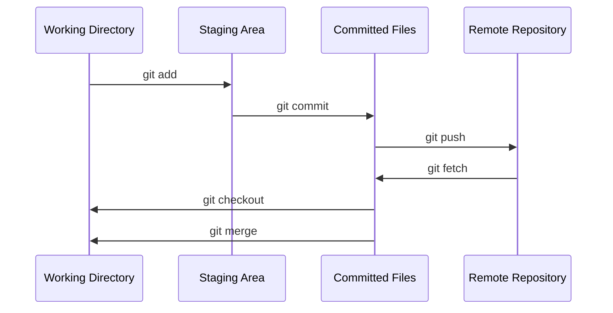

## What is a Version Control System?

Version control systems are software tools that helps to keep track of modifications made to codes and files. Software development often requires collaboration of several developers who might not be sharing the same locations. However, each of them make certain contribution to the development by making changes to the codes and files. A separate branch is created everytime a contributor makes some changes and once the code is analyzed and green-signalled, they changes are merged with the main source codes. It keeps the source code organized and makes the development process smooth. 

Git is a version control system.

## Brief History of Git

During the early years of Linux Kernel development (1991 - 2002), [Linus Torvalds](https://en.wikipedia.org/wiki/Linus_Torvalds){:target="_blank"}, who is the creator and historically, the main developer of Linux kernel had a large number of volunteer developers working on the project and their contributions had to be managed. Initially all changes to the software were passed around in patches and stored in archives. 

However, in 2002 the project started using a proprietary DVCS (distributed version control system) called [BitKeeper](https://en.wikipedia.org/wiki/BitKeeper){:target="_blank"}. It was a great tool for managing all the developer contributions and in spite of being a paid software, it was available to Linux developers for free due to an agreement between the two parties.

Everything was fine until April 2005, when [Andrew Tridgell](https://en.wikipedia.org/wiki/Andrew_Tridgell){:target="_blank"}, an Australian computer programmer, tried to produce a free software, now known as [SourcePuller](https://sourceforge.net/projects/sourcepuller/files/){:target="_blank"} which interoperated with the BitKeeper source code repository. This led to a fiery controversy which resulted in BitKeeper revoking the tool's free-of-charge status for Linux developers. Many developers lost their access to the BitKeeper and Linus Torvalds knew that he had to come up with something fast. It is said that he took a vacation! And the result of that vacation was the birth of a new version control system - Git!

## Why is Git Popular?

Git has several strong features like

- Simple in design
- Small and speedy
- Strong support for non-linear development (thousands of parallel branches)
- Fully distributed
- Automatic garbage collection

## How Git Works?

Git uses simple commands to allow users to track code changes and manage projects. At the very center of Git is a [repository](https://en.wikipedia.org/wiki/Software_repository){:target="_blank"} which contains a project. This repository can be stored locally or on the web, e.g. GitHub. Throughout the process of development, a project has several save points. These save points are called **commits**. A commit history contains all the changes implemented during the development process and allows smooth rollback or fast forward to any point in the commit history. Git uses **SHA-1 hashes** to refer to the commits. Every commit has an unique hash pointing towards it. This allows Git to create a tree-like structure to store and retrieve data.

In a typical Git project, the files go through the following stages:

 - **Working Directory**: This is where the modified files are. They are not yet tracked and not ready for commit.
 - **Staging Directory**: The modified files are added to this area for reviewing the changes before making the final commit.
 - **Committed**: Snapshots of files from Staging Area are saved in the commit history.

A basic Git workflow is explained in the following diagram.

Now that we know the basic concepts of Git, we will dive into how to install Git and explain a few basic commands to work with in the next part.